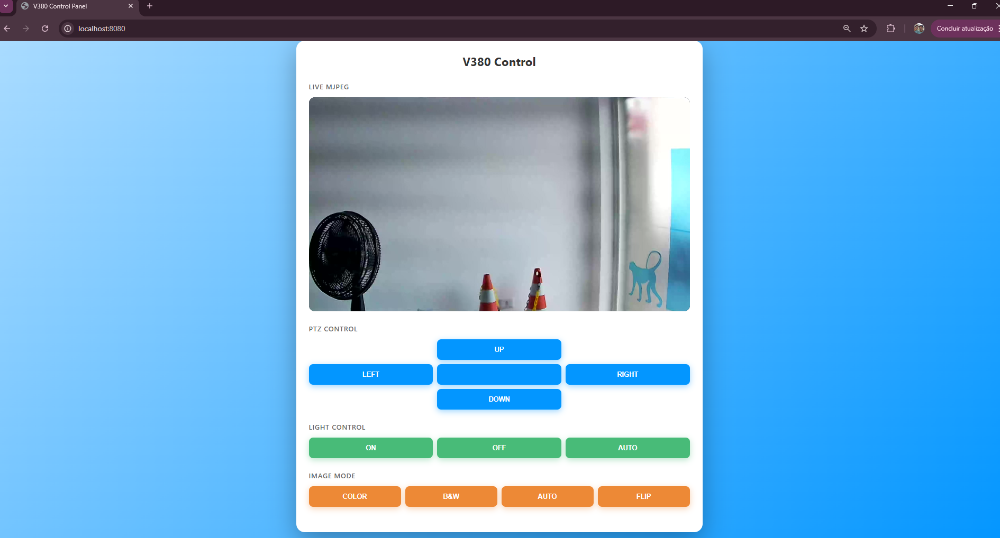
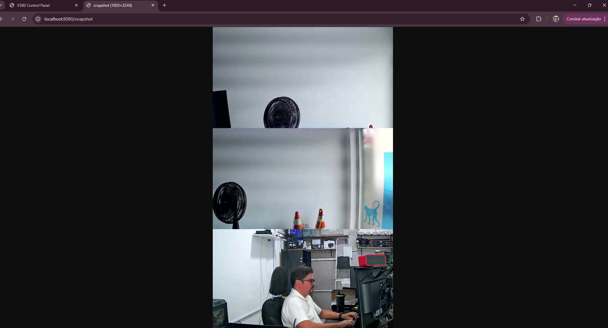
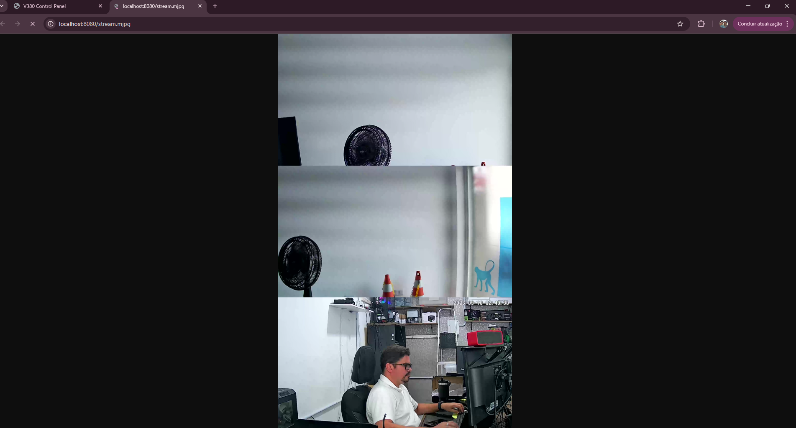
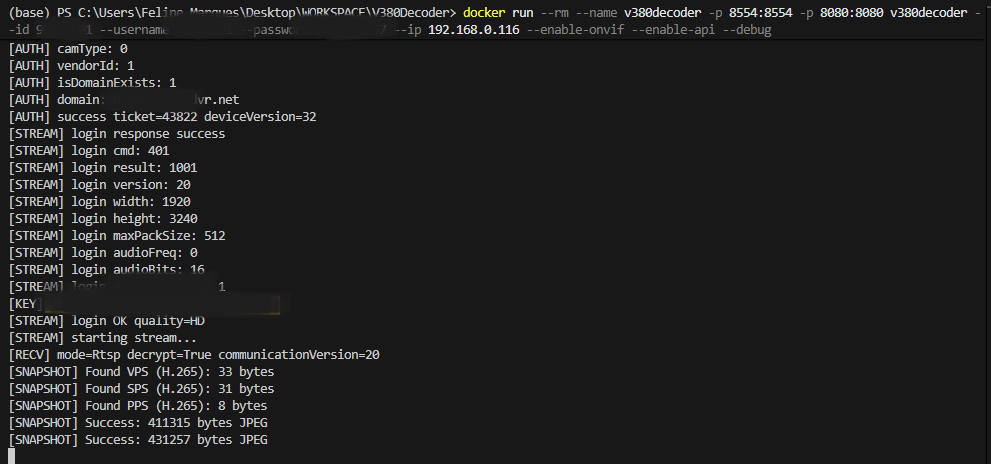
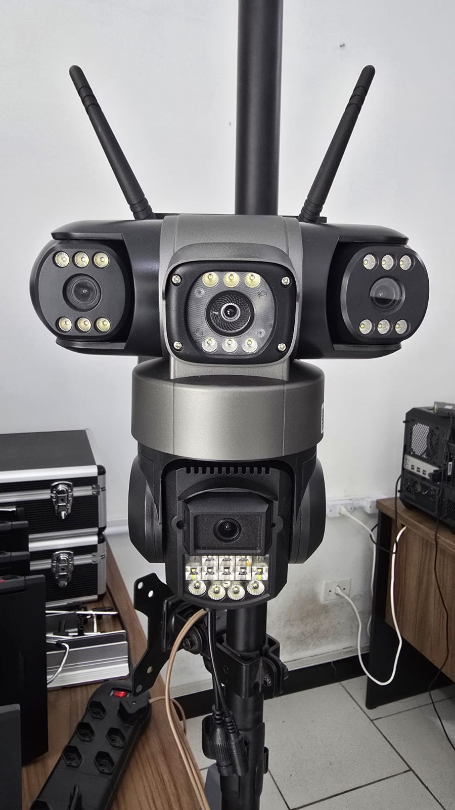

# V380 Decoder

Decode encrypted video and audio streams from V380 cameras and expose them through local services such as RTSP, ONVIF, snapshot HTTP, MJPEG, Web UI, and REST API.

This project is based on reverse engineering of the V380 protocol and is a C#/.NET port of [prsyahmi/v380](https://github.com/prsyahmi/v380), extended to work with newer encrypted cameras and more recent 3-lens models.

## Current Features

- Audio and video decryption for newer V380 devices
- LAN and cloud relay support
- RTSP server output
- ONVIF endpoints for NVR and client integration
- Web UI for PTZ, light, and image controls
- REST API for camera control
- Snapshot endpoint
- MJPEG endpoint for browser-friendly live preview
- Docker support with FFmpeg available inside the container

## Demo Screenshots

### Frontend



### Snapshot endpoint



### MJPEG stream



### Running container



### Additional tested camera



## Tested Cameras

### Camera A

- Software version: `AppEV2W_VA3_V2.5.9.5_20231211`
- Firmware version: `Hw_AWT3710D_XHR_V1.0_WF_20230519`

### Camera B

- Software version: `AppEV2W_VA3_V1.3.7.0_20231211`
- Firmware version: `Hw_AWT3610E_XHR_E_V1.0_WF_20230607`

### Camera C

- QR payload: `V380^95886601^HsXMQQFC^67^64^1909170003^20250116193300`
- Device ID: `95886601`
- Software version: `AppXM5_V1_V1.0.1.0_20241030`
- Firmware version: `Hw_HsXMQQFC_WF_QQ_20240806`
- Notes: reported by user and added as an additional known-working/newer device reference for this project

## Quick Start With Docker

Build the image:

```bash
docker build -t v380decoder .
```

Run the container:

```bash
docker run --rm --name v380decoder -p 8554:8554 -p 8080:8080 v380decoder --id 95xxx601 --username 95XXX601 --password xxxxx --ip 192.168.0.116 --enable-onvif --enable-api --debug
```

### Main endpoints

- Web UI: `http://localhost:8080`
- Snapshot: `http://localhost:8080/snapshot`
- MJPEG: `http://localhost:8080/stream.mjpg`
- RTSP: `rtsp://localhost:8554/live`
- ONVIF: `http://localhost:8080/onvif/device_service`
- API root: `http://localhost:8080/api/`

## Docker Notes

- On Windows, prefer `-p 8554:8554 -p 8080:8080` instead of `--network host`.
- The container can be stopped by name:

```bash
docker stop v380decoder
```

- If you want lower stream load for MJPEG/snapshot use cases, the current code also supports:

```bash
docker run --rm --name v380decoder -p 8554:8554 -p 8080:8080 v380decoder --id 95xxx601 --username 95XXX601 --password xxxxx --ip 192.168.0.116 --enable-onvif --enable-api --debug --quality sd
```

## Command Line Arguments

| Argument | Default | Required | Description |
|----------|---------|----------|-------------|
| `--id` | - | Yes | Camera device ID |
| `--username` | `admin` | Yes | Camera username |
| `--password` | - | Yes | Camera password |
| `--ip` | - | LAN only | Camera IP address |
| `--port` | `8800` | No | Camera port |
| `--source` | `lan` | No | `lan` or `cloud` |
| `--output` | `rtsp` | No | `video`, `audio`, or `rtsp` |
| `--quality` | `hd` | No | Stream quality: `sd` or `hd` |
| `--rtsp-port` | `8554` | No | RTSP server port |
| `--http-port` | `8080` | No | HTTP server port |
| `--enable-api` | `false` | No | Enable Web UI and REST API |
| `--enable-onvif` | `false` | No | Enable ONVIF services |
| `--discover` | `false` | No | Discover compatible devices on LAN |
| `--debug` | `false` | No | Enable verbose logs |
| `--help` | `false` | No | Show help |

## Usage Examples

### Discover devices

```bash
./V380Decoder --discover
```

### Video to stdout

```bash
./V380Decoder --id 12345678 --username admin --password password --ip 192.168.1.2 --output video | ffplay -f h264 -i pipe:0
```

### Audio to stdout

```bash
./V380Decoder --id 12345678 --username admin --password password --ip 192.168.1.2 --output audio | ffplay -f alaw -ar 8000 -ac 1 -i pipe:0
```

### RTSP and API

```bash
./V380Decoder --id 12345678 --username admin --password password --ip 192.168.1.2 --enable-onvif --enable-api
```

### Cloud relay mode

```bash
./V380Decoder --id 12345678 --username admin --password password --source cloud --enable-api
```

### Lower-load SD mode

```bash
./V380Decoder --id 12345678 --username admin --password password --ip 192.168.1.2 --enable-api --quality sd
```

## Web UI and API

The built-in web UI exposes a control panel for:

- PTZ up, down, left, right, stop
- Light on, off, auto
- Image mode color, B/W, auto, flip
- Snapshot preview
- MJPEG browser preview

### REST API examples

```bash
curl -X POST http://localhost:8080/api/ptz/up
curl -X POST http://localhost:8080/api/ptz/down
curl -X POST http://localhost:8080/api/ptz/left
curl -X POST http://localhost:8080/api/ptz/right

curl -X POST http://localhost:8080/api/light/on
curl -X POST http://localhost:8080/api/light/off
curl -X POST http://localhost:8080/api/light/auto

curl -X POST http://localhost:8080/api/image/color
curl -X POST http://localhost:8080/api/image/bw
curl -X POST http://localhost:8080/api/image/auto
curl -X POST http://localhost:8080/api/image/flip

curl http://localhost:8080/api/status
```

## ONVIF

Enable ONVIF with:

```bash
./V380Decoder --id 12345678 --username admin --password password --ip 192.168.1.2 --enable-onvif
```

Endpoint:

```text
http://localhost:8080/onvif/device_service
```

Current ONVIF scope of support includes:

- device information
- media profiles
- snapshot URI
- stream URI
- PTZ controls
- imaging/light related actions already exposed by the camera commands

## Tested Camera Notes

The original repository notes successful testing with device version `31`. This fork has also been extended to deal with more recent firmware variants and 3-lens encrypted models that expose H.265 payloads and different frame fragmentation behavior.

## Latest Commit Summary

Latest commit:

```text
4bc6b43 fixes for 3 lens camera
```

### Improvements introduced in that commit

#### 1. Restore and packaging reliability

- Added repo-local `NuGet.Config` so package restore works even on machines with missing global NuGet sources.
- Updated the Docker image to install `ffmpeg`, making snapshot decoding and related media handling available inside the container.

#### 2. Major parser work for newer encrypted cameras

- Reworked `src/V380Client.cs` to better reassemble fragmented media frames using fragment sequence information instead of relying on older assumptions about outer frame types.
- Improved payload extraction and normalization for encrypted video packets.
- Added broader heuristics for detecting H.264 and H.265 NAL units.
- Extended handling for newer devices using communication version 20/21 style payloads.
- Added support needed to deal with 3-lens camera payload patterns that did not match older V380 models.

#### 3. Better media metadata tracking

- Expanded `src/FrameData.cs` to explicitly track video codec information.
- Added keyframe-oriented logic based on parsed NAL headers instead of trusting older frame markers.

#### 4. RTSP pipeline updates

- Reworked `src/RtspServer.cs` and `src/RtspSession.cs` to improve how parsed frames are routed and packetized.
- Added `src/H264Transcoder.cs` to support H.265 to H.264 conversion for RTSP compatibility where possible.
- Improved SPS/PPS extraction and SDP generation logic for RTSP consumers.

#### 5. Snapshot and image extraction improvements

- Reworked `src/SnapshotManager.cs` to detect and handle both H.264 and H.265 parameter sets.
- Added FFmpeg-based decode fallback for snapshots.
- Improved cache handling and frame reuse for HTTP snapshot access.

#### 6. Web and API improvements

- Expanded `src/WebServer.cs` for snapshot and browser streaming endpoints.
- Improved `src/WebPage.cs` to provide a more practical built-in control panel and live preview area.

#### 7. Application lifecycle and runtime behavior

- Updated `Program.cs` to improve runtime setup and shutdown behavior.
- Added clearer logging around stream startup, codec handling, and service exposure.

## Current Practical Behavior

At the moment, the most reliable path for these newer 3-lens cameras is:

- Web UI and API: working
- PTZ/light/image controls: working
- Snapshot endpoint: working
- MJPEG endpoint: working, but limited by how often the camera provides decodable keyframes
- RTSP: present, but reliability still depends heavily on the exact firmware and codec behavior of the camera

For many 3-lens H.265 devices, the bottleneck is not HTTP itself but the cadence of clean, independently decodable frames made available by the camera firmware.

## Build From Source

```bash
git clone https://github.com/PyanSofyan/V380Decoder.git
cd V380Decoder
dotnet build
dotnet run -- --id 12345678 --username admin --password password --ip 192.168.1.2
```

## Publish

```bash
dotnet publish -c Release -r linux-x64 --self-contained true -p:PublishSingleFile=true -o ./publish/linux-x64
dotnet publish -c Release -r linux-arm64 --self-contained true -p:PublishSingleFile=true -o ./publish/linux-arm64
dotnet publish -c Release -r linux-arm --self-contained true -p:PublishSingleFile=true -o ./publish/linux-arm
dotnet publish -c Release -r win-x64 --self-contained true -p:PublishSingleFile=true -o ./publish/win-x64
dotnet publish -c Release -r win-x86 --self-contained true -p:PublishSingleFile=true -o ./publish/win-x86
```

## Run As A Service

Example `systemd` unit:

```ini
[Unit]
Description=V380 Camera Decoder
After=network.target

[Service]
Type=simple
User=YOUR_USERNAME
WorkingDirectory=/home/YOUR_USERNAME/v380decoder
ExecStart=/home/YOUR_USERNAME/v380decoder/V380Decoder --id 12345678 --username admin --password password --ip 192.168.1.2 --enable-onvif --enable-api
Restart=always
RestartSec=5

[Install]
WantedBy=multi-user.target
```

## Acknowledgements

- [prsyahmi/v380](https://github.com/prsyahmi/v380) for the original reverse engineering work
- [Cyberlink Security](https://cyberlinksecurity.ie/vulnerabilities-to-exploit-a-chinese-ip-camera/) for protocol and vulnerability research around V380 devices
- Tooling used in the broader reverse engineering workflow: Wireshark, PacketSender, JADX, Ghidra, and Frida
